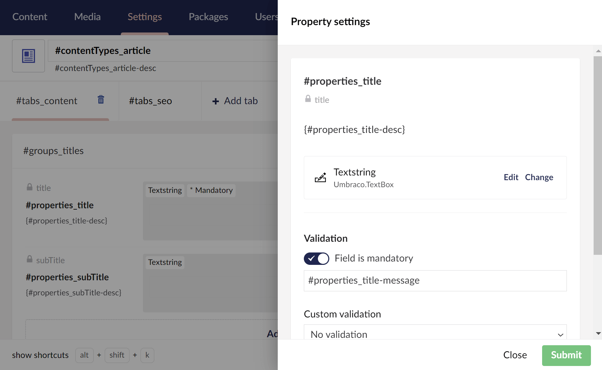
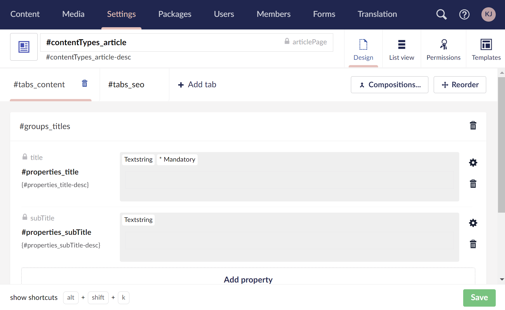

# Document Type Localization


This article is a work in progress and may undergo further revisions, updates, or amendments. The information contained herein is subject to change without notice.


The Umbraco backoffice is localized to match the [user's configured language](../users/README.md).

When defining a Document Type, you can apply localization to:

* Document Type name and description.
* Property names and descriptions.
* Custom property validation messages.
* Tab and group names.

Setting up localization for Document Types is a two-step process:

* Create the localizations in [user defined backoffice localization file](../../../customizing/foundation/localization.md).
* Apply the localizations to the Document Type.


Everything in this article also applies to defining [Media Types](../creating-media/) and Member Types.


## Creating localizations

Once you have [registered a backoffice localization file](../../../customizing/extending-overview/extension-types/localization.md), you can add your localization texts for use in Document Types. The following localizations are used for the samples in this article:


```js
export default {
    contentTypes: {
        article: 'Article page',
        'article-desc': 'A textual, article-like page on the site. Use this as the main type of content.',
        landing: 'Landing page',
        'landing-desc': 'An inviting, very graphical page. Use this as an entry point for a campaign, and supplement with Articles.'
    },
    tabs: {
        content: 'Page content',
        seo: 'SEO configuration',
    },
    groups: {
        titles: 'Page titles'
    },
    properties: {
        title: 'Main title',
        'title-desc': 'This is the main title of the page.',
        'title-message': 'The main title is required for this page.',
        subTitle: 'Sub title',
        'subTitle-desc': 'This is the sub title of the page.',
    }
};
```



Umbraco must be restarted to register the localization manifest. Any subsequent localization text changes will need to be reloaded within the browser.


## Applying localizations

The localizations are applied by using the syntax `#{area alias}_{key alias}`.

1. Create a **Document Type with template** called `#contentTypes_article` with **alias**: `articlePage`.
2. Under the newly created Document Type follow these steps:

* Name the **description** to `#contentTypes_article-desc`.
* Create a new **tab** called `#tabs_content`.
* Add a new **group** called `#groups_titles`.
* Add a **property** called `#properties_title` with **alias** `title`.
  * Set description to `{#properties_title-desc}`.
  * Use a `TextString` editor.
  * Enable to `Set this field as mandatory`.
  * Under validation add `#properties_title-message`.


Property descriptions support [Umbraco Flavored Markdown](../../../reference/umbraco-flavored-markdown), which uses a different syntax (wrapped in brackets) to avoid conflicts with Markdown headers.




* Add a **property** called `#properties_subTitle` with **alias** `subTitle`.
  * Set description to `{#properties_subTitle-desc}`.
  * Use a `TextString` editor.
* Enable `Allow at root` in the **Structure** tab.



3. When creating and editing the content, you will see that the backoffice now uses the configured localizations.


4. Create a new "Article" content:


4. When trying to save the content without adding the mandatory content, you will see a warning as expected:


