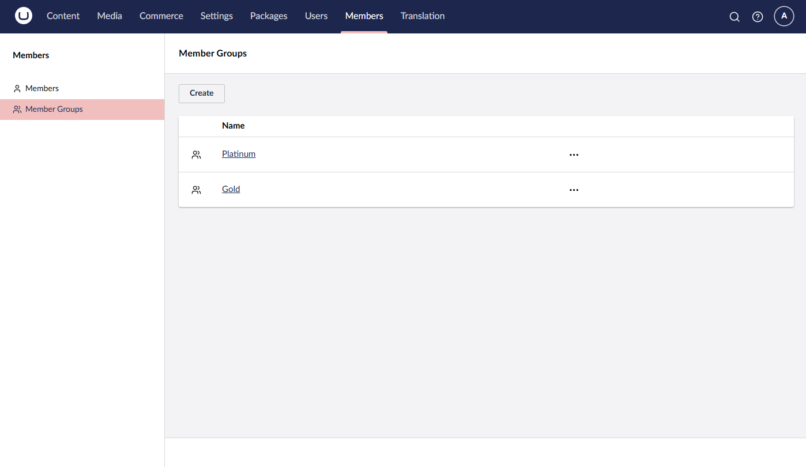
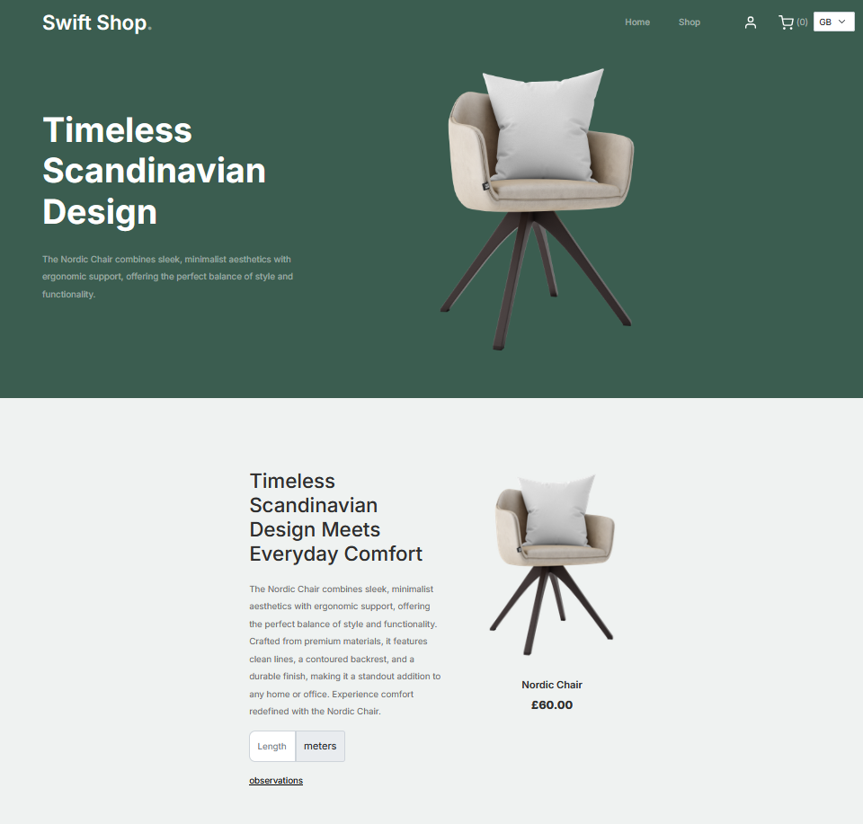

# Implementing Member Based Pricing

By default Umbraco Commerce uses a single price for a product. However, in some cases you may want to have different prices for different customers. In this guide we will show you how to implement member based pricing in Umbraco Commerce.

## Member Configuration

Start by creating the member groups that you want to use for the member based pricing. In this example we will use two member groups:

* Platinum
* Gold



Then create two members, one for each group:


## Property Editor Configuration

Next we will create a new property editor for the member based pricing. We will use the in built block list editor.

First in this setup, create a `Member Price` element type with a `Price` and `Member Group` property. For the `Price` property we will use the default Umbraco Commerce `Price` property editor, and for the `Member Group` property we will use the in-built `Member Group Picker` property editor.


Next modify the product document type adding a new `Member Price` property using a new block list property editor configuration with the `Member Price` element type selected as the only allowed block type.


Finally, in the content section, for any product you wish to assign member based pricing, populate the `Member Price` field with the required member group and price combination.


## Product Adapter

With our prices defined, it's now time to configure Umbraco Commerce to select the correct price based on the logged in member group. This is done by creating a custom product adapter that will override the default product adapter and select the correct price based on the logged in member group.

````csharp
public class MemberPricingProductAdapter : UmbracoProductAdapter
{
    private readonly IHttpContextAccessor _httpContextAccessor;
    private readonly IMemberService _memberService;
    private readonly IMemberGroupService _memberGroupService;
    private readonly UmbracoCommerceContext _umbracoCommerce;

    public MemberPricingProductAdapter(
        IUmbracoContextFactory umbracoContextFactory, 
        IContentService contentService, 
        PublishedContentWrapperFactory publishedContentWrapperFactory, 
        IExamineManager examineManager, 
        PublishedContentHelper publishedContentHelper, 
        IUmbracoProductNameExtractor umbracoProductNameExtractor, 
        UmbracoCommerceServiceContext services,
        IHttpContextAccessor httpContextAccessor,
        IMemberService memberService,
        IMemberGroupService memberGroupService,
        UmbracoCommerceContext umbracoCommerce) 
        : base(umbracoContextFactory, contentService, publishedContentWrapperFactory, examineManager, publishedContentHelper, umbracoProductNameExtractor, services)
    {
        _httpContextAccessor = httpContextAccessor;
        _memberService = memberService;
        _memberGroupService = memberGroupService;
        _umbracoCommerce = umbracoCommerce;
    }

    public override async Task<IProductSnapshot> GetProductSnapshotAsync(Guid storeId, string productReference, string productVariantReference, string languageIsoCode, CancellationToken cancellationToken = default)
    {
        var baseSnapshot = (UmbracoProductSnapshot)await base.GetProductSnapshotAsync(storeId, productReference, productVariantReference, languageIsoCode, cancellationToken);

        if (_httpContextAccessor.HttpContext?.User.Identity is { IsAuthenticated: true }
            && baseSnapshot is { Content: Product { MemberPrice: not null } productPage }
            && productPage.MemberPrice.Any())
        {
            var memberId = _httpContextAccessor.HttpContext.User.Claims.First(x => x.Type == ClaimTypes.NameIdentifier).Value;
            var memberGroupName = _memberService.GetAllRoles(int.Parse(memberId)).First();
            var memberGroupId = (await _memberGroupService.GetByNameAsync(memberGroupName))!.Id;

            var memberPrice = productPage.MemberPrice
                .Select(x => x.Content as MemberPrice)
                .FirstOrDefault(x => int.Parse(x.MemberGroup) == memberGroupId);
                
            if (memberPrice != null)
            {
                var list2 = new List<ProductPrice>();

                var currencies = await _umbracoCommerce.Services.CurrencyService.GetCurrenciesAsync(baseSnapshot.StoreId);
                foreach (var currency in currencies)
                {
                    var productPrice = memberPrice.Price!.TryGetPriceFor(currency.Id);
                    if (memberPrice.Price != null && productPrice.Success)
                    {
                        list2.Add(new ProductPrice(productPrice.Result!.Value, productPrice.Result.CurrencyId));
                    }
                }

                baseSnapshot.Prices = list2;
            }
        }
        
        return baseSnapshot;
    }
}
````

To register the custom product adapter, add the following to a `Composer` file:

````csharp
internal class SwiftShopComposer : IComposer
{
    public void Compose(IUmbracoBuilder builder)
    {
        builder.Services.AddUnique<IProductAdapter, MemberPricingProductAdapter>();
    }
}
````

## Results

With all this implemented, the product page will now display the correct price based on the logged in members group.

The expected result for this standard product page



And for a `Gold` member


For a `Platinum` member


