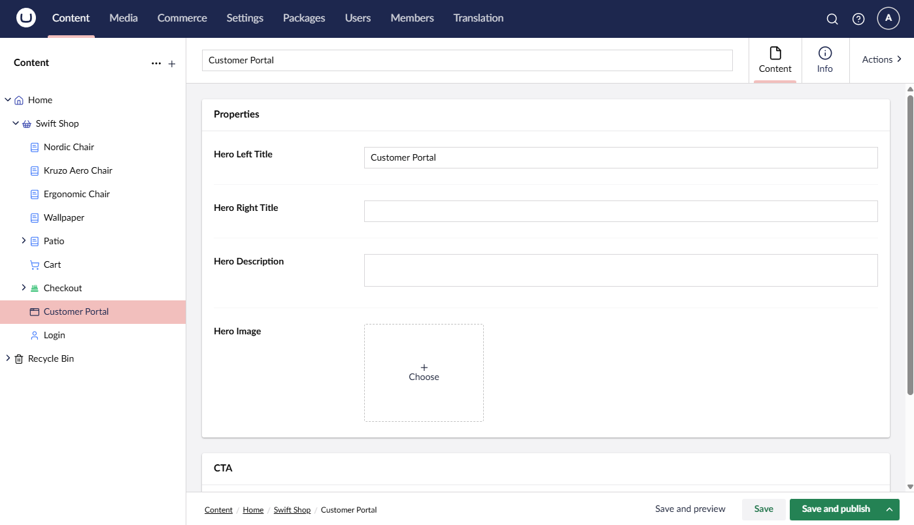
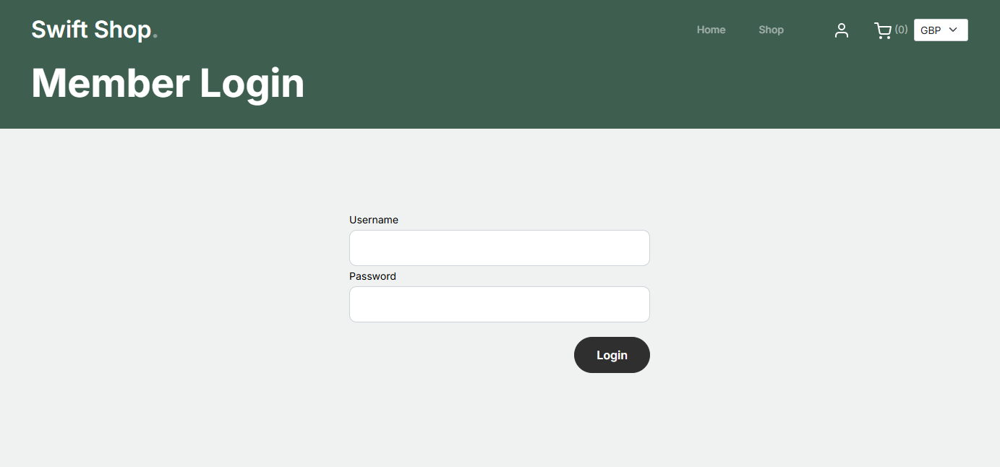
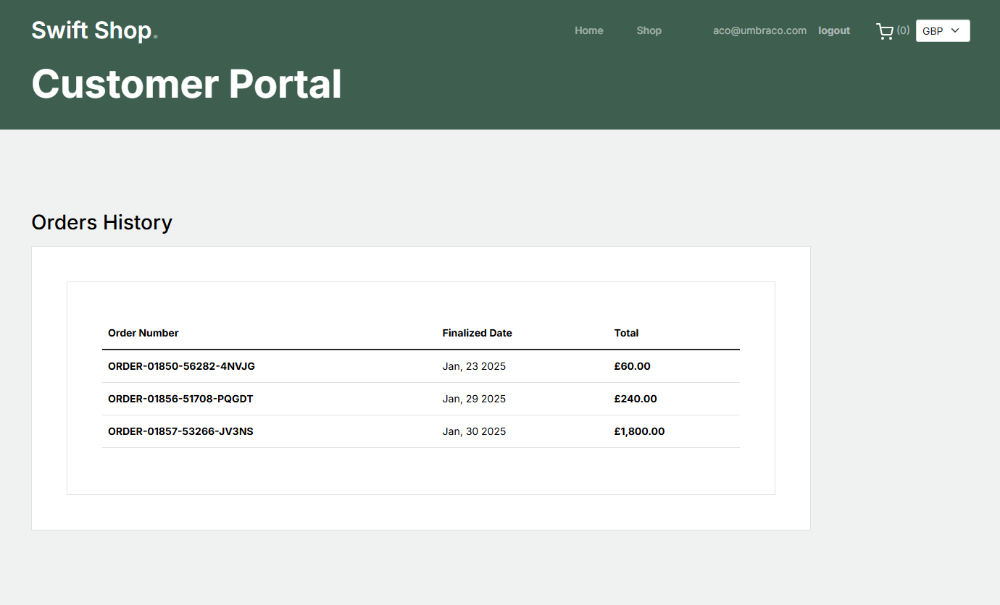
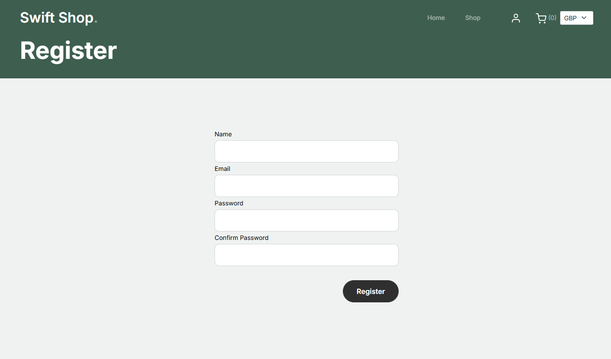

# Building a Members Portal

A members portal is a private area of your website where customers can access their order history, manage their account details, and view personalized content. This guide will show you how to build a members portal in Umbraco Commerce.

## Setting Up the Members

The first step in building a members portal is to create a Member Type for your customers. This Member Type will define the properties that customers can have, such as their name, email address, and password.

### Creating a Member Group

1. Navigate to the **Members** section of the backoffice.
2. Click the **+** button next to the **Member Groups** heading in the navigation to create a new Member Type. 
3. Enter a name for the Member Group, such as `Customer`.


4. Click the **Save** button to create the Member Group.

### Assigning Members to the Customer Member Group

1. Navigate to the **Members** section of the backoffice.
2. Click on the **Members** tab in the navigation.
3. Click on the Member you want to assign to the `Customer` Member Group.
4. Select the `Customer` Member Group in the **Member Group** property.


5. Click the **Save** button to assign the Member to the `Customer` Member Group.

## Setting Up the Member Area

The next step in building a members portal is to create the pages and templates that will make up the members area of your website.

### Document Type Setup

1. Navigate to the **Settings** section of the backoffice.
2. Create two new Document Types: `Customer Portal` and `Login`.


3. Update your site root Document Type to include the `Customer Portal` and `Login` Document Types as child-pages.


### Content Setup

1. Navigate to the **Content** section of the backoffice.
2. Create a new page using the `Customer Portal` Document Type and name it `Customer Portal`.
3. Create a new page using the `Login` Document Type and name it `Login`.



4. Expand the context menu for the `Customer Portal` node by clicking the three dots.
5. Click on the **Public Access** option.
6. Choose the **Group based protection** option in the **Public Access** dialog and select **Next**.
7. Select the `Customer` Member Group for the group option.
8. Select the `Login` node for the login and error page options.


9. Click **Save** to apply the public access settings.

## Implementing a Member Login

To access the members portal, customers need to log in. Through the following steps a login form allowing customers to enter their username and password to access the portal is created.

1. Open the `Login.cshtml` template file.
2. Add the following code to create a login form:

```csharp
@using (Html.BeginUmbracoForm<UmbLoginController>("HandleLogin", new { RedirectUrl = "/customer-portal" }))
{
    <div asp-validation-summary="ModelOnly"></div>
        
    <div>
        <label asp-for="@loginModel.Username">Username</label>
        <input asp-for="@loginModel.Username" />
        <span asp-validation-for="@loginModel.Username"></span>
    </div>
    
    <div>
        <label asp-for="@loginModel.Password">Password</label>
        <input asp-for="@loginModel.Password" />
        <span asp-validation-for="@loginModel.Password"></span>
    </div>
    
    <button type="submit">Login</button>
}
```


The `UmbLoginController` class comes pre-installed with Umbraco and handles the login process for you, so you don't need to create a custom controller.


On the frontend, customers can enter their username and password and click the **Login** button to access the members portal.



## Displaying Member Order History

Now that members can log in, update the `Customer Portal` page to display the order history for the logged-in member.

1. Open the `CustomerPortal.cshtml` template file.
2. Add the following code to display the order history:

```csharp
@inject IMemberManager memberManager
@inject IUmbracoCommerceApi commerceApi
@inherits Umbraco.Cms.Web.Common.Views.UmbracoViewPage
@{
	var store = Model.GetStore();

	var currentMember = await memberManager.GetCurrentMemberAsync();
	var orders = currentMember != null
		? await commerceApi.GetFinalizedOrdersForCustomerAsync(store.Id, currentMember.Email)
		: Enumerable.Empty<OrderReadOnly>();
}

@if (orders.Count() > 0)
{
    <table>
        <thead>
            <th>Order Number</th>
            <th>Date</th>
            <th>Total</th>
        </thead>
        <tbody>
            @foreach (var order in orders)
            {
                <tr>
                    <td><strong>@order.OrderNumber</strong></td>
                    <td>@order.FinalizedDate?.ToString("MMM, d yyyy")</td>
                    <td><strong>@(await order.TotalPrice.Value.FormattedAsync())</strong></td>
                </tr>
            }
        </tbody>
    </table>
}
else
{
    <h2>You haven't placed any orders yet</h2>
}
```

The `Customer Portal` page will now display a table of the member's order history, including the order number, date, and total price.



### Assigning Orders to a Customer

The order history will display all orders that have been finalized for the logged-in member. Orders created whilst the member is logged in will automatically be associated with the member. If you wish to assign an order to a member at any point, you can use the API method:

```csharp
writableOrder.AssignToCustomer(member.Key.ToString());
```

## Extras

### Displaying Member Login Status

In your site header, add the following code to display the member login status:

```csharp
@{
    var isLoggedIn = Context.User?.Identity?.IsAuthenticated ?? false;
    if (isLoggedIn)
    {
        <a href="/customer-portal">@Context.User?.Identity?.Name</a>
        @using (Html.BeginUmbracoForm<UmbLoginStatusController>("HandleLogout", new { RedirectUrl = rootPage.Url() }, new { @name = "logoutForm" }))
        {
            <button type="submit"><strong>logout</strong></button>
        }
    } 
    else 
    {
        <a href="/login">Login</a>
    }
}
```

  

  

### Registering a Member

To allow customers to register as members, you can create a registration form allowing customers to enter their name, email address, and password.

1. Implement a registration Document Type and page in the same way as the login page.
2. Open the `Register.cshtml` template file and add the following code to create a registration form:

```csharp
@using (Html.BeginUmbracoForm<UmbRegisterController>("HandleRegisterMember", new { RedirectUrl = "/customer-portal", UsernameIsEmail = true }))
{
    <div asp-validation-summary="ModelOnly"></div>
        
    <div>
        <label asp-for="@registerModel.Name">Name</label>
        <input asp-for="@registerModel.Name" />
        <span asp-validation-for="@registerModel.Name"></span>
    </div>
    
    <div>
        <label asp-for="@registerModel.Email">Email</label>
        <input asp-for="@registerModel.Email" />
        <span asp-validation-for="@registerModel.Email"></span>
    </div>
    
    <div>
        <label for="email">Password</label>
        <input asp-for="@registerModel.Password" />
        <span asp-validation-for="@registerModel.Password"></span>
    </div>
    
    <div>
        <label for="email">Confirm Password</label>
        <input asp-for="@registerModel.ConfirmPassword" />
        <span asp-validation-for="@registerModel.ConfirmPassword"></span>
    </div>
    
    <button type="submit">Register</button>
}
```


The `UmbRegisterController` class comes pre-installed with Umbraco. It handles the login process, so you don't need to create a custom controller.


On the frontend, customers can enter their name, email address, and password to register as a member.


