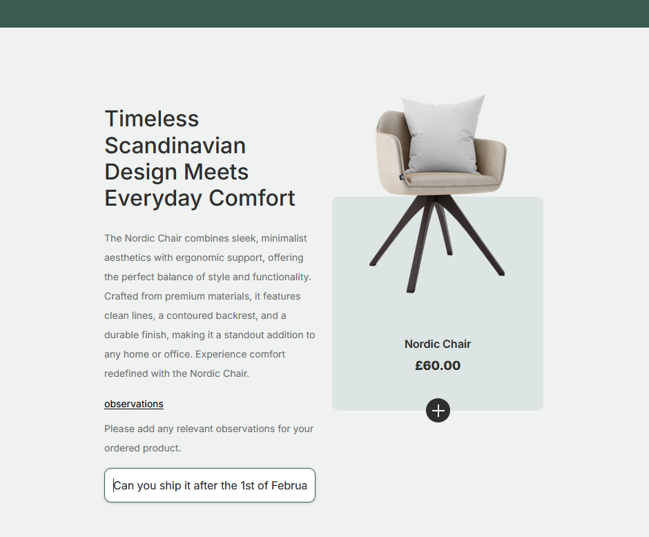
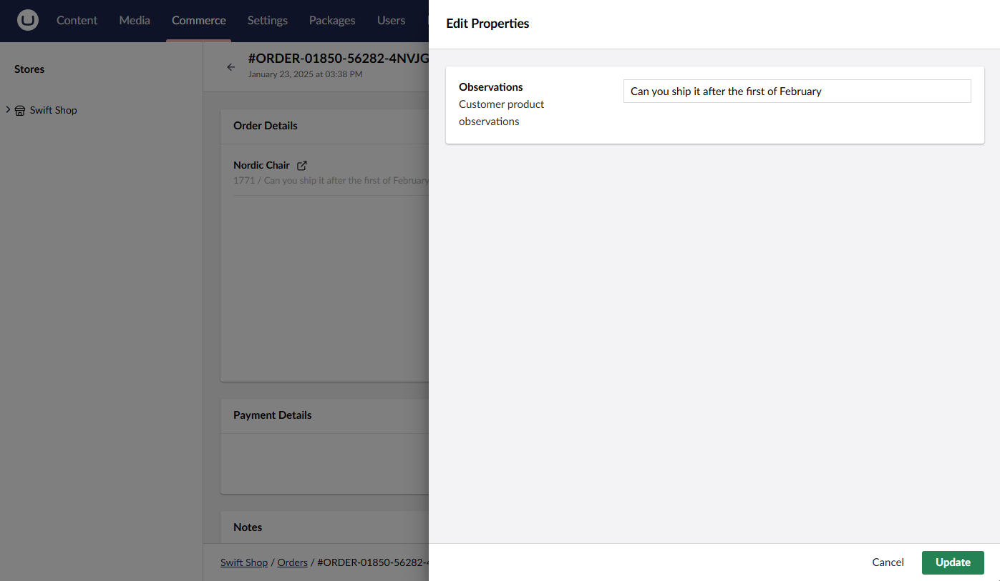

# Implementing Personalized Products

Personalized products are products that can be customized by the customer. This customization can be as simple as adding a message or as complex as selecting different options for the product. In this guide, we will show you how to implement personalized products in Umbraco Commerce.

This will be broken down into the following steps:

* Add a message field on the product page in the add to cart form
* Save the details in an order line [property](../key-concepts/properties.md)
* Register an UI extension to display the value in the Backoffice.

## Capturing a Message

On the frontend, we'll add a text area to the product page where the customer can enter their message.



## Saving the Message as an Order Line Property

When the customer adds the product to the cart, we'll save the message in an order line property.

To capture this message we'll add a `Observations` property of the `AddToCartDto`

````csharp
public class AddToCartDto
{
    ...

    public string? Observations { get; set; }
}
````

In our `AddToCart` action, if a value has been sent with the request, we set a property on the order line.

````csharp
[HttpPost]
public async Task<IActionResult> AddToCart(AddToCartDto postModel)
{
    try
    {
        await _commerceApi.Uow.ExecuteAsync(async uow =>
        {
            var store = CurrentPage.GetStore();
            var order = await _commerceApi.GetOrCreateCurrentOrderAsync(store.Id)
                .AsWritableAsync(uow)
                .AddProductAsync(postModel.ProductReference, decimal.Parse(postModel.Quantity), new Dictionary<string, string>{
                    { "productObservations", postModel.Observations }
                });

            await _commerceApi.SaveOrderAsync(order);

            uow.Complete();
        });
    }
    catch (ValidationException ex)
    {
        ...
    }
}
````

## Accessing the Property in the Backoffice

To view the data in the Backoffice order editor, we need to register an `ucOrderProperty` extension along with the relevant label localizations as sampled below:

````csharp
{
  "name": "SwiftShop",
  "extensions": [
    {
      "type": "ucOrderLineProperty",
      "alias": "Uc.OrderLineProperty.ProductObservations",
      "name": "Product Observations",
      "weight": 400,
      "meta": {
        "propertyAlias": "productObservations",
        "editorUiAlias": "Umb.PropertyEditorUi.TextBox",
        "labelUiAlias": "Umb.PropertyEditorUi.Label"
      }
    },
    {
      "type": "localization",
      "alias": "Uc.OrderLineProperty.ProductObservations.EnUS",
      "name": "English",
      "meta": {
        "culture": "en",
        "localizations": {
          "section": {
            "ucProperties_productObservationsLabel": "Observations",
            "ucProperties_productObservationsDescription": "Customer product observations"
          }
        }
      }
    }
  ]
}
````
With this in place, the property will be displayed in the Backoffice order editor.




