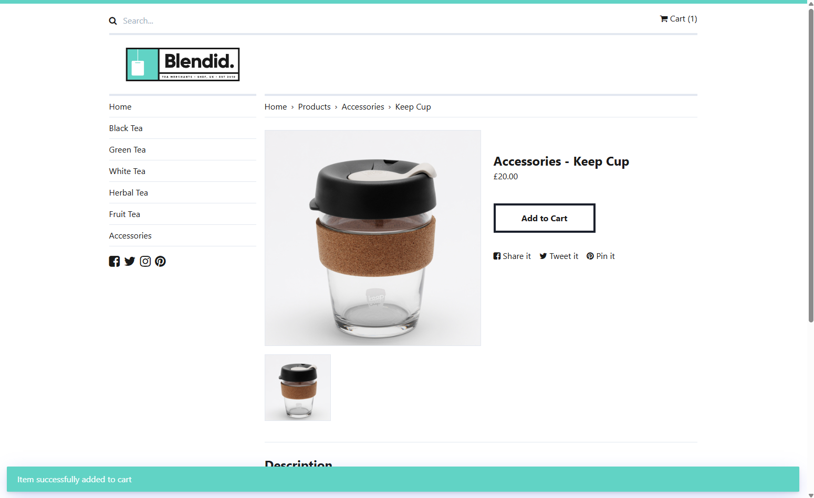
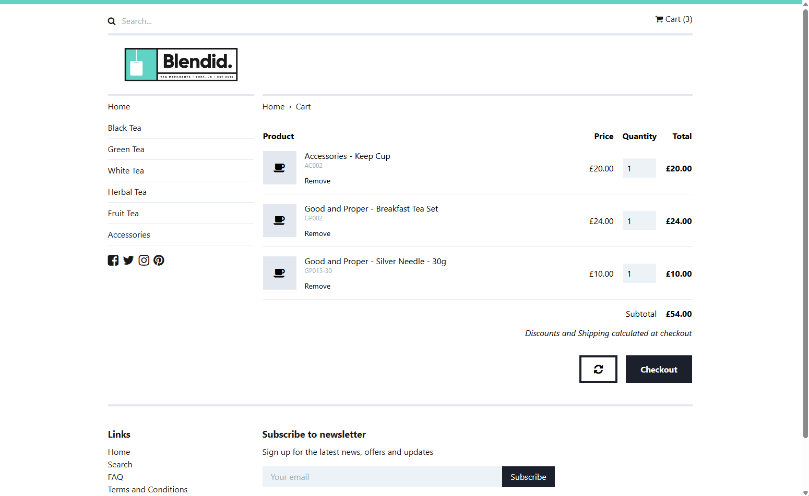

# Creating a Custom Shopping Cart

If you need a more custom shopping cart experience, you can build a custom shopping cart using the Umbraco Commerce API. This approach gives you full control over the shopping cart experience, allowing you to tailor it to your requirements.

## Create a Cart Surface Controller

Before adding any functionality to the custom shopping cart, you must create a Surface Controller to handle the cart actions.

1. Create a new class in your project and inherit from `Umbraco.Cms.Web.Website.Controllers.SurfaceController`.
2. Name the class `CartSurfaceController`.
3. Add the following code to the class:



```csharp
using Umbraco.Cms.Core.Cache;
using Umbraco.Cms.Core.Logging;
using Umbraco.Cms.Core.Routing;
using Umbraco.Cms.Core.Services;
using Umbraco.Cms.Core.Web;
using Umbraco.Cms.Infrastructure.Persistence;
using Umbraco.Cms.Web.Website.Controllers;
using Umbraco.Commerce.Core.Api;

namespace Umbraco.Commerce.DemoStore.Controllers;

public class CheckoutSurfaceController : SurfaceController
{
    private readonly IUmbracoCommerceApi _commerceApi;

    public CheckoutSurfaceController(
        IUmbracoContextAccessor umbracoContextAccessor, 
        IUmbracoDatabaseFactory databaseFactory, 
        ServiceContext services, 
        AppCaches appCaches, 
        IProfilingLogger profilingLogger, 
        IPublishedUrlProvider publishedUrlProvider,
        IUmbracoCommerceApi commerceApi) 
        : base(umbracoContextAccessor, databaseFactory, services, appCaches, profilingLogger, publishedUrlProvider)
    {
        _commerceApi = commerceApi;
    }

    // Add your cart actions here
}
```



## Adding a Product to the Cart

To add a product to the cart, create an action method in the `CartSurfaceController`. The action should accept a `productReference` or `productVariantReference` and add the product to the cart. The properties will be wrapped in a DTO class to pass on to the controller.

1. Create a new class named `AddToCartDto` using the following properties.



```csharp
namespace Umbraco.Commerce.DemoStore.Dtos;

public class AddToCartDto
{
    public string ProductReference { get; set; }
    public string ProductVariantReference { get; set; }
    public decimal Quantity { get; set; } = 1;
}
```



2. Add the following action method to your `CartSurfaceController`:



```csharp
[HttpPost]
public async Task<IActionResult> AddToCart(AddToCartDto postModel)
{
    try
    {
        await commerceApi.Uow.ExecuteAsync(async uow =>
        {
            StoreReadOnly store = CurrentPage!.GetStore()!;
            Order? order = await commerceApi.GetOrCreateCurrentOrderAsync(store.Id)!
                .AsWritableAsync(uow)
                .AddProductAsync(postModel.ProductReference, postModel.ProductVariantReference, postModel.Quantity);
            await commerceApi.SaveOrderAsync(order);
            uow.Complete();
        });
    }
    catch (ValidationException ex)
    {
        ModelState.AddModelError("productReference", "Failed to add product to cart");

        return CurrentUmbracoPage();
    }

    TempData["successMessage"] = "Product added to cart";

    return RedirectToCurrentUmbracoPage();
}
```



3. Open the view where you want to add a product to the cart.
4. Create a form that posts to the `AddToCart` action of your `CartSurfaceController`.



```html
<div class="col-12 col-md-4 col-lg-3 mb-5 mb-md-0">
    @using (Html.BeginUmbracoForm("AddToCart", "CartSurface"))
    {
        @Html.Hidden("productReference", Model.GetProductReference())
        @Html.Hidden("quantity", 1)

        <div>
            <h3>@Model.Title</h3>
            <p>@Model.Description</p>
            <p>@(await Model.CalculatePriceAsync().FormattedAsync())</p>
            <button type="submit">Add to Basket</button>
        </div>
    }
</div>
```



On the front end, when the user clicks the "Add to Basket" button, the product will be added to the cart.



### Showing a Cart Count

The total cart quantity is managed through a [view component](https://learn.microsoft.com/en-us/aspnet/core/mvc/views/view-components?view=aspnetcore-9.0) that displays a counter near the shopping cart icon.

1. Create a new view component named `CartCountViewComponent`.



````csharp
[ViewComponent]
public class CartCountViewComponent : ViewComponent
{
    public async Task<IViewComponentResult> InvokeAsync(IPublishedContent currentPage)
    {
        var store = currentPage.GetStore();
        var order = await currentPage.GetCurrentOrderAsync();

        return View("CartCount", (int)(order?.TotalQuantity ?? 0));
    }
}
````



2. Create a partial view named `CartCount.cshtml` to display the cart count.



```html
@model int
<span>(@Model)</span>
```



3. Include the view component in your layout or view to display the cart count.



```html
<a href="/cart">Cart @(await Component.InvokeAsync("CartCount", new { currentPage = Model }))</a>
```



### Showing Cart Notifications

1. Create a new class named `NotificationModel`.



```csharp
public class NotificationModel
{
    public string Text { get; set; }
    public NotificationType Type { get; set; }
}

public enum NotificationType
{
    Success,
    Error
}
```



2. Create a partial view named `Notification.cshtml`.



```csharp
@model Umbraco.Commerce.DemoStore.Models.NotificationModel

<link rel="stylesheet" type="text/css" href="https://cdn.jsdelivr.net/npm/toastify-js/src/toastify.min.css">
<script type="text/javascript" src="https://cdn.jsdelivr.net/npm/toastify-js"></script>
<script>
    document.addEventListener('DOMContentLoaded', function () {
        Toastify({
            text: "@(Model.Text)",
            duration: 3000,
            gravity: "bottom",
            position: 'center',
            backgroundColor: @(Model.Type == NotificationType.Success ? "#008236" : "#c10007"),
            stopOnFocus: true
        }).showToast();
    });
</script>
```



3. Reference the partial view in your layout or view to display cart notifications.



```csharp
@{
    var message = TempData["successMessage"] ?? TempData["errorMessage"];
    var type = TempData["successMessage"] != null ? NotificationType.Success : NotificationType.Error;
    
    if (message != null)
    {
        await Html.PartialAsync("Notification", new Umbraco.Commerce.DemoStore.Models.NotificationModel
        {
            Text = message,
            Type = type
        })
    }
}
``` 



## Displaying the Cart

You can create a new view that lists the items in the cart and allows the user to update or remove items.

1. Create a new `Cart` Document Type and add it as a content node beneath the store root.
7. Open the `Cart.cshtml` template created by your Document Type and add the following.



```csharp
@{
    var order = await Model.GetCurrentOrderAsync();

    if (order != null && order.OrderLines.Count > 0)
    {
        using (Html.BeginUmbracoForm("UpdateCart", "CartSurface"))
        {
            <table>
                <thead>
                    <tr>
                        <th>Product</th>
                        <th>Price</th>
                        <th>Quantity</th>
                        <th>Total</th>
                    </tr>
                </thead>
                <tbody>
                    @foreach (var item in order.OrderLines.Select((ol, i) => new { OrderLine = ol, Index = i }))
                    {
                        @Html.Hidden($"orderLines[{item.Index}].Id", orderLine.Id)
                            
                        var product = Umbraco.Content(Guid.Parse(item.OrderLine.ProductReference));
                        var image = product.Value<IPublishedContent>(nameof(Product.Image));
                        
                        <tr>
                            <td>
                                <h3>@product.Name</h3>
                                <p><a href="@Url.SurfaceAction("RemoveFromCart",  "CartSurface", new { OrderLineId = item.OrderLine.Id })">Remove</a></p>
                            </td>
                            <td>@(await item.OrderLine.UnitPrice.Value.FormattedAsync())</td>
                            <td>
                                @Html.TextBox($"orderLines[{item.Index}].Quantity", (int)item.OrderLine.Quantity, new { @type = "number", @class = "form-control text-center quantity-amount" })            
                            </td>
                            <td>@(await orderLine.TotalPrice.Value.FormattedAsync())</td>
                        </tr>
                    }
                </tbody>
                <tfoot>
                    <tr>
                        <td colspan="3">Subtotal</td>
                        <td>@(await order.SubtotalPrice.WithoutAdjustments.FormattedAsync())</td>
                    </tr>
                    <tr>
                        <td colspan="4">Discounts and Shipping calculated at checkout</td>
                    </tr>
                    <tr>
                        <td colspan="4">
                            <div>
                                <button type="submit">Update Cart</button>
                                <a href="/checkout">Checkout</a>
                            </div>
                        </td>
                    </tr>
                </tfoot>
            </table>
        }
    }
    else
    {
        <p>Your cart is empty</p>
    }
}
```



3. Access the frontend of the website.
4. Navigate to the cart page to view the items in the cart.



## Updating a Cart Item

In the [Cart view above](#displaying-the-cart) you have wrapped the cart markup in a form that posts to an `UpdateCart` action on the `CartSurfaceController`. Additionally, for each order line, you render a hidden input for the `Id` of the order line and a numeric input for it's `Quantity`. When the **Update Cart** button is clicked, the form will post all the order lines and their quantities to the `UpdateCart` action to be updated.

1. Create a new class named `UpdateCartDto` using the following properties.



```csharp
namespace Umbraco.Commerce.DemoStore.Dtos;

public class UpdateCartDto
{
    public OrderLineQuantityDto[] OrderLines { get; set; }
}

public class OrderLineQuantityDto
{
    public Guid Id { get; set; }

    public decimal Quantity { get; set; }
}

```



2. Add the following action method to your `CartSurfaceController`:



```csharp
[HttpPost]
public async Task<IActionResult> UpdateCart(UpdateCartDto postModel)
{
    try
    {
        await commerceApi.Uow.ExecuteAsync(async uow =>
        {
            StoreReadOnly store = CurrentPage!.GetStore()!;
            Order order = await commerceApi.GetOrCreateCurrentOrderAsync(store.Id)!
                .AsWritableAsync(uow);

            foreach (OrderLineQuantityDto orderLine in postModel.OrderLines)
            {
                await order.WithOrderLine(orderLine.Id)
                    .SetQuantityAsync(orderLine.Quantity);
            }

            await commerceApi.SaveOrderAsync(order);
            uow.Complete();
        });
    }
    catch (ValidationException ex)
    {
        TempData["errorMessage"] = "Failed to update cart";

        return CurrentUmbracoPage();
    }

    TempData["successMessage"] = "Cart updated";

    return RedirectToCurrentUmbracoPage();
}
```



3. Access the frontend of the website.
4. Update the quantity of an item in the cart and click the **Update Cart** button.

## Removing a Cart Item

In the [Cart view above](#displaying-the-cart) for each order line you render a remove link that triggers a `RemoveFromCart` action on the `CartSurfaceController`. This uses the `Url.SurfaceAction` helper to call a surface action as a GET request instead of a POST request. When the **Remove** link is clicked, the order line will be removed from the cart.

To hook up the remove link, perform the following steps:

1. Create a new class named `RemoveFromCartDto` using the following properties.



```csharp
namespace Umbraco.Commerce.DemoStore.Dtos;

public class RemoveFromCartDto
{
    public Guid OrderLineId { get; set; }
}
```



2. Add the following action method to your `CartSurfaceController`:



```csharp
[HttpGet]
public async Task<IActionResult> RemoveFromCart(RemoveFromCartDto postModel)
{
    try
    {
        await commerceApi.Uow.ExecuteAsync(async uow =>
        {
            StoreReadOnly store = CurrentPage!.GetStore()!;
            Order order = await commerceApi.GetOrCreateCurrentOrderAsync(store.Id)!
                .AsWritableAsync(uow)
                .RemoveOrderLineAsync(postModel.OrderLineId);
            await commerceApi.SaveOrderAsync(order);
            uow.Complete();
        });
    }
    catch (ValidationException ex)
    {
        TempData["errorMessage"] = "Failed to remove cart item";

        return CurrentUmbracoPage();
    }

    return RedirectToCurrentUmbracoPage();
}
```



3. Access the frontend of the website.
4. Click the **Remove** link on the cart item to remove it from the cart.

## Useful Extension Methods

In the examples above, you used several `IPublishedContent` extension methods to simplify the code. Here are some of the most useful extension methods:



```csharp
public static StoreReadOnly? GetStore(this IPublishedContent content)
{
    return content.AncestorOrSelf<Shop>()?.Store;
}
 
public static async Task<OrderReadOnly?> GetCurrentOrderAsync(this IPublishedContent content)
{
    var store = content.GetStore();
    
    if (store == null)
    {
        return null;
    }

    return await UmbracoCommerceApi.Instance.GetCurrentOrderAsync(store.Id);
}
```


