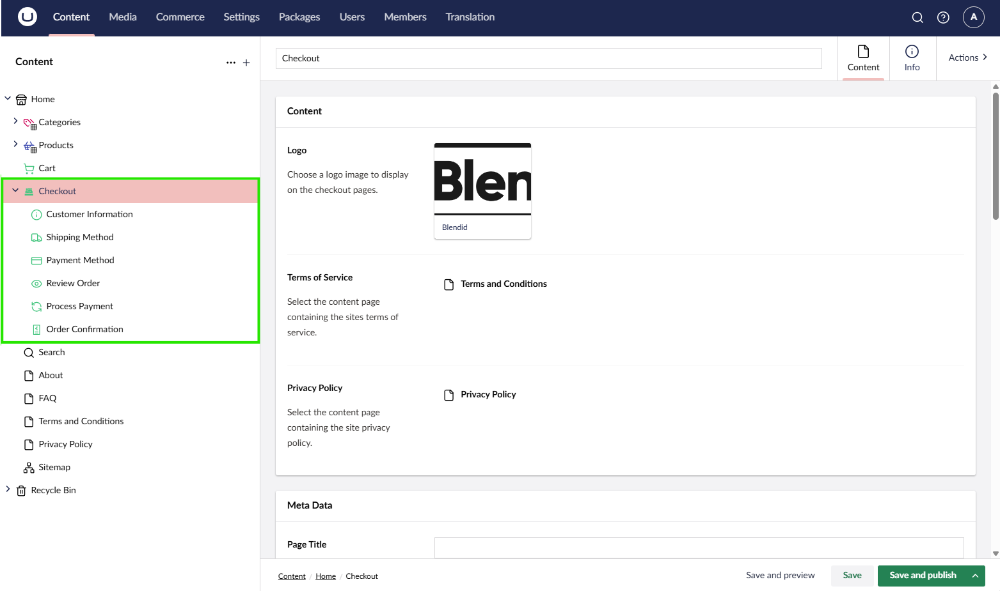
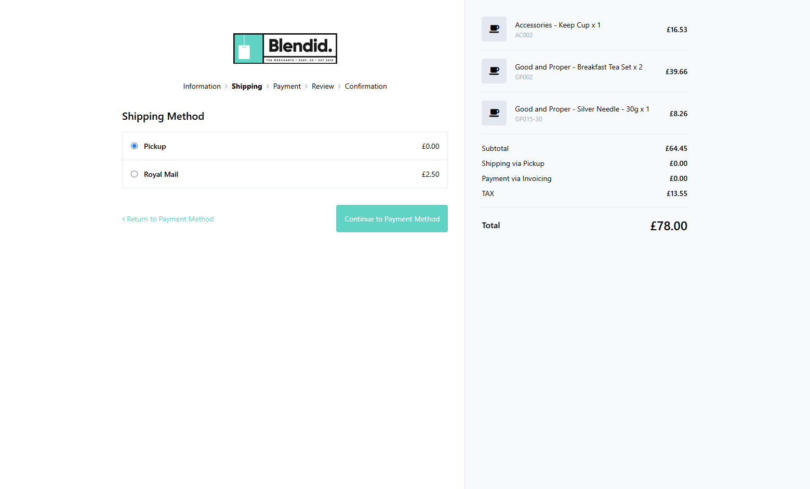
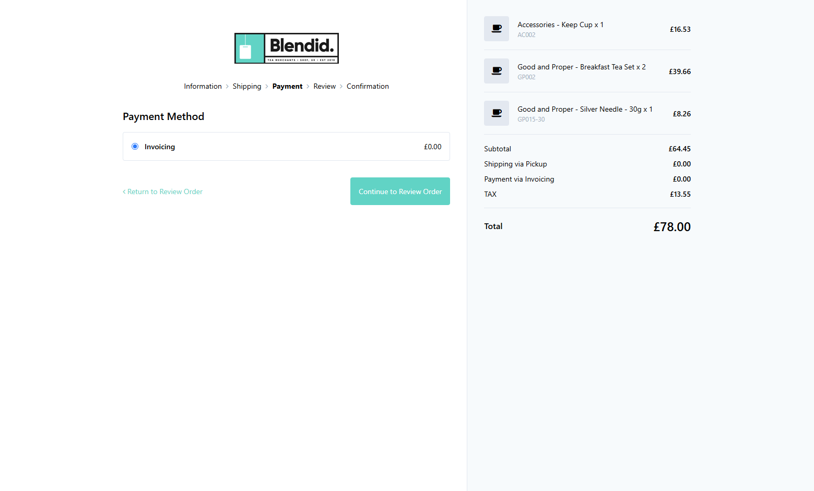
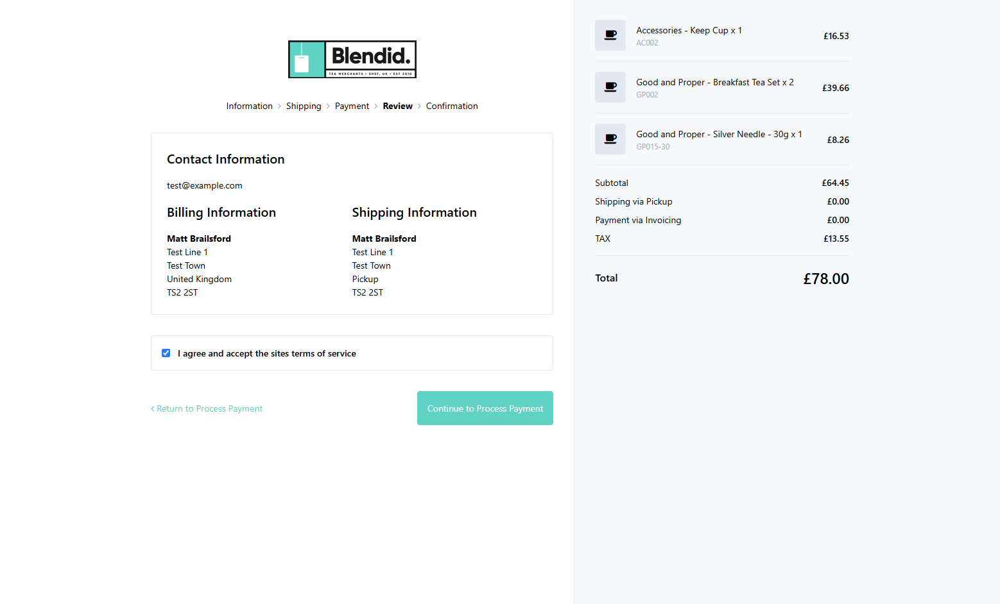
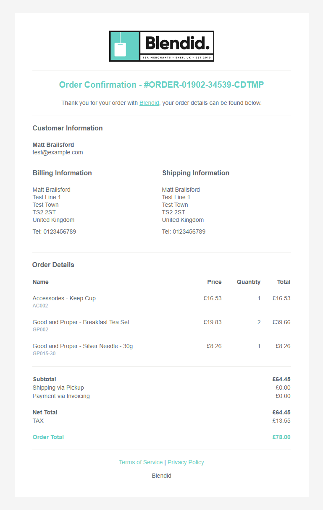
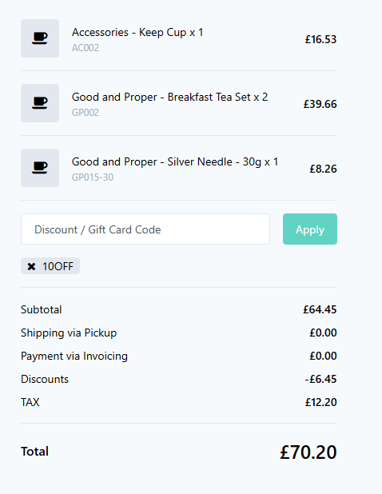

# Creating a Custom Checkout Flow

If you need a more custom checkout experience, you can build a custom checkout flow using the Umbraco Commerce API. This approach gives you full control over the checkout experience, allowing you to tailor it to your specific requirements.

## Create a Checkout Surface Controller

To create a custom checkout flow, add a custom Surface Controller to handle the checkout process.

1. Create a new class and inherit from `Umbraco.Cms.Web.Website.Controllers.SurfaceController`.
2. Name the class `CheckoutSurfaceController`.
3. Add the following code to the class:

```csharp
using Umbraco.Cms.Core.Cache;
using Umbraco.Cms.Core.Logging;
using Umbraco.Cms.Core.Routing;
using Umbraco.Cms.Core.Services;
using Umbraco.Cms.Core.Web;
using Umbraco.Cms.Infrastructure.Persistence;
using Umbraco.Cms.Web.Website.Controllers;
using Umbraco.Commerce.Core.Api;

namespace Umbraco.Commerce.SwiftShop.Controllers;

public class CheckoutSurfaceController : SurfaceController
{
    private readonly IUmbracoCommerceApi _commerceApi;

    public CheckoutSurfaceController(
        IUmbracoContextAccessor umbracoContextAccessor, 
        IUmbracoDatabaseFactory databaseFactory, 
        ServiceContext services, 
        AppCaches appCaches, 
        IProfilingLogger profilingLogger, 
        IPublishedUrlProvider publishedUrlProvider,
        IUmbracoCommerceApi commerceApi) 
        : base(umbracoContextAccessor, databaseFactory, services, appCaches, profilingLogger, publishedUrlProvider)
    {
        _commerceApi = commerceApi;
    }

    // Add your checkout actions here
}
```

## Define the Checkout Steps

Before you can start building the checkout flow, you must define the steps the customer goes through. A typical checkout flow consists of the following steps:

* Collecting Customer Information.
* Selecting a Shipping Method.
* Selecting a Payment Method.
* Reviewing Order Details.
* Showing an Order Confirmation.

To accommodate these steps, you must create a few new Document Types for each step (or one with multiple templates, one per step). Each Document Type will represent a step in the checkout flow. 

1. Create Document Types for each of the steps above, adding only properties that make sense for your setup.



## Collecting Customer Information

To collect customer information, you need to create an action method in our `CheckoutSurfaceController`. This should accept the details and update the order accordingly. The properties will be wrapped in a DTO class to pass it to the controller.

1. Create a new class and name it `UpdateOrderInformationDto` using the following properties.

```csharp
namespace Umbraco.Commerce.DemoStore.Dtos;

public class UpdateOrderInformationDto
{
    public string Email { get; set; }
    public bool MarketingOptIn { get; set; }
    public OrderAddressDto BillingAddress { get; set; }
    public OrderAddressDto ShippingAddress { get; set; }
    public bool ShippingSameAsBilling { get; set; }
    public string Comments { get; set; }
}

public class OrderAddressDto
{
    public string FirstName { get; set; }
    public string LastName { get; set; }
    public string Line1 { get; set; }
    public string Line2 { get; set; }
    public string ZipCode { get; set; }
    public string City { get; set; }
    public Guid Country { get; set; }
    public string Telephone { get; set; }
}

```

2. Add the following action method to your `CheckoutSurfaceController`.

```csharp
public async Task<IActionResult> UpdateOrderInformation(UpdateOrderInformationDto model)
{
    try
    {
        await commerceApi.Uow.ExecuteAsync(async uow =>
        {
            var store = CurrentPage!.GetStore()!;
            var order = await commerceApi.GetCurrentOrderAsync(store.Id)!
                .AsWritableAsync(uow)
                .SetPropertiesAsync(new Dictionary<string, string>
                {
                    { Constants.Properties.Customer.EmailPropertyAlias, model.Email },
                    { "marketingOptIn", model.MarketingOptIn ? "1" : "0" },

                    { Constants.Properties.Customer.FirstNamePropertyAlias, model.BillingAddress.FirstName },
                    { Constants.Properties.Customer.LastNamePropertyAlias, model.BillingAddress.LastName },
                    { "billingAddressLine1", model.BillingAddress.Line1 },
                    { "billingAddressLine2", model.BillingAddress.Line2 },
                    { "billingCity", model.BillingAddress.City },
                    { "billingZipCode", model.BillingAddress.ZipCode },
                    { "billingTelephone", model.BillingAddress.Telephone },

                    { "shippingSameAsBilling", model.ShippingSameAsBilling ? "1" : "0" },
                    { "shippingFirstName", model.ShippingSameAsBilling ? model.BillingAddress.FirstName : model.ShippingAddress.FirstName },
                    { "shippingLastName", model.ShippingSameAsBilling ? model.BillingAddress.LastName : model.ShippingAddress.LastName },
                    { "shippingAddressLine1", model.ShippingSameAsBilling ? model.BillingAddress.Line1 : model.ShippingAddress.Line1 },
                    { "shippingAddressLine2", model.ShippingSameAsBilling ? model.BillingAddress.Line2 : model.ShippingAddress.Line2 },
                    { "shippingCity", model.ShippingSameAsBilling ? model.BillingAddress.City : model.ShippingAddress.City },
                    { "shippingZipCode", model.ShippingSameAsBilling ? model.BillingAddress.ZipCode : model.ShippingAddress.ZipCode },
                    { "shippingTelephone", model.ShippingSameAsBilling ? model.BillingAddress.Telephone : model.ShippingAddress.Telephone },

                    { "comments", model.Comments }
                })
                .SetPaymentCountryRegionAsync(model.BillingAddress.Country, null)
                .SetShippingCountryRegionAsync(model.ShippingSameAsBilling ? model.BillingAddress.Country : model.ShippingAddress.Country, null);
            await commerceApi.SaveOrderAsync(order);
            uow.Complete();
        });
    }
    catch (ValidationException ex)
    {
        ModelState.AddModelError("", "Failed to update information");

        return CurrentUmbracoPage();
    }

    return Redirect("/checkout/shipping-method");
}
```

3. Open the view for the `Collecting Customer Information` step.
4. Create a form that posts to the `UpdateOrderInformation` action method of the `CheckoutSurfaceController`, passing the customer information.

```csharp
@inject IUmbracoCommerceApi UmbracoCommerceApi
@inherits Umbraco.Cms.Web.Common.Views.UmbracoViewPage<CheckoutInformationPage>
@{
    var store = Model.GetStore();
    var order = await UmbracoCommerceApi.GetCurrentOrderAsync(store!.Id);
    var countries = await UmbracoCommerceApi.GetCountriesAsync(store!.Id)   
}

<script>
    toggleShippingInfo = function() {
        var shippingSameAsBilling = document.querySelector('input[name="shippingSameAsBilling"]');
        var shippingInfo = document.getElementById('shipping-info');
        shippingInfo.style.display = shippingSameAsBilling.checked ? 'none' : 'block';
    }
    document.addEventListener('DOMContentLoaded', function() {
        shippingSameAsBilling.addEventListener('change', toggleShippingInfo);
        toggleShippingInfo();
    });    
</script>
    
@using (Html.BeginUmbracoForm("UpdateOrderInformation", "CheckoutSurface"))
{
    <h3>Contact Information</h3>
    <input name="email" type="email" placeholder="Email" value="@(order.CustomerInfo.Email)" required />
    <label>
        <input name="marketingOptIn" type="checkbox" value="true" @Html.Raw(order.Properties["marketingOptIn"] == "1" ? "checked=\"checked\"" : "") /> Keep me up to date on news and exclusive offers
    </label>
    
    <h3>Billing Address</h3>
    <input name="billingAddress.Firstname" type="text" placeholder="First name" value="@(order.CustomerInfo.FirstName)" required />
    <input name="billingAddress.Lastname" type="text" placeholder="Last name" value="@(order.CustomerInfo.LastName)" required />
    <input name="billingAddress.Line1" type="text" placeholder="Address (line 1)" value="@(order.Properties["billingAddressLine1"])" required />
    <input name="billingAddress.Line2" type="text" placeholder="Address (line 2)" value="@(order.Properties["billingAddressLine2"])" />
    <input name="billingAddress.City" type="text" placeholder="City" value="@(order.Properties["billingCity"])" required />
    <select name="billingAddress.Country" placeholder="Country">
        @foreach (var country in countries)
        {
            <!option value="@(country.Id)" @Html.Raw(order.PaymentInfo.CountryId == country.Id ? "selected=\"selected\"" : "")>@(country.Name)</!option>
        }
    </select>
    <input name="billingAddress.ZipCode" type="text" placeholder="Postcode" value="@(order.Properties["billingZipCode"])" required />
    <input name="billingAddress.Telephone" type="text" placeholder="Phone" value="@(order.Properties["billingTelephone"])" />

    <label>
        <input name="shippingSameAsBilling" type="checkbox" value="true" @Html.Raw(order.Properties["shippingSameAsBilling"] == "1" || !order.Properties.ContainsKey("shippingSameAsBilling") ? "checked=\"checked\"" : "") /> Shipping address is same as billing address
    </label>
    
    <div id="shipping-info" style="display: none;">
        <h3>Shipping Address</h3>
        <input name="shippingAddress.Firstname" type="text" placeholder="First name" value="@(order.Properties["shippingFirstName"])" />
        <input name="shippingAddress.Lastname" type="text" placeholder="Last name" value="@(order.Properties["shippingLastName"])" />
        <input name="shippingAddress.Line1" type="text" placeholder="Address (line 1)" value="@(order.Properties["shippingAddressLine1"])" />
        <input name="shippingAddress.Line2" type="text" placeholder="Address (line 2)" value="@(order.Properties["shippingAddressLine2"])" />
        <input name="shippingAddress.City" type="text" placeholder="City" value="@(order.Properties["shippingCity"])" />
        <select name="shippingAddress.Country" placeholder="Country">
            @foreach (var country in countries)
            {
                <!option value="@(country.Id)" @Html.Raw(order.ShippingInfo.CountryId == country.Id ? "selected=\"selected\"" : "")>@(country.Name)</!option>
            }
        </select>
        <input name="shippingAddress.ZipCode" type="text" placeholder="Postcode" value="@(order.Properties["shippingZipCode"])" />
        <input name="shippingAddress.Telephone" type="text" placeholder="Phone" value="@(order.Properties["shippingTelephone"])" />
    </div>
            
    <h3>Comments</h3>
    <textarea name="comments" placeholder="Enter any comments here">@(order.Properties["comments"])</textarea>

    <div>
        <a href="/cart">Return to Cart</a>
        <button type="submit">Continue to Shipping Method</button>
    </div>
}
```

The customer can fill out their details and proceed to the next step in the checkout flow.


## Selecting a Shipping Method

1. Create a new class and name it `UpdateShippingMethodDto` using the following properties.

```csharp
namespace Umbraco.Commerce.DemoStore.Dtos;

public class UpdateOrderShippingMethodDto
{
    public Guid ShippingMethod { get; set; }
    public string ShippingOptionId { get; set; }
}
```

2. Add the following action method to your `CheckoutSurfaceController`.

```csharp
public async Task<IActionResult> UpdateOrderShippingMethod(UpdateOrderShippingMethodDto model)
{
    try
    {
        await commerceApi.Uow.ExecuteAsync(async uow =>
        {
            var store = CurrentPage!.GetStore()!;
            var order = await commerceApi.GetCurrentOrderAsync(store.Id)!
                .AsWritableAsync(uow);

            if (!string.IsNullOrWhiteSpace(model.ShippingOptionId))
            {
                var shippingMethod = await commerceApi.GetShippingMethodAsync(model.ShippingMethod);
                Attempt<ShippingRate> shippingRateAttempt = await shippingMethod.TryCalculateRateAsync(model.ShippingOptionId, order);
                await order.SetShippingMethodAsync(model.ShippingMethod, shippingRateAttempt.Result!.Option);
            }
            else
            {
                await order.SetShippingMethodAsync(model.ShippingMethod);
            }

            await commerceApi.SaveOrderAsync(order);
            uow.Complete();
        });
    }
    catch (ValidationException ex)
    {
        ModelState.AddModelError("", "Failed to set order shipping method");

        return CurrentUmbracoPage();
    }

    return RedirectToUmbracoPage("/checkout/payment-method");
}
```

3. Open the view for the `Selecting a Shipping Method` step.
4. Create a form that posts to the `UpdateOrderShippingMethod` action method of the `CheckoutSurfaceController`, passing the selected shipping method.

```csharp
@inject IUmbracoCommerceApi UmbracoCommerceApi
@inherits Umbraco.Cms.Web.Common.Views.UmbracoViewPage<Umbraco.Commerce.DemoStore.Models.CheckoutShippingMethodPage>
@{
    var store = Model.GetStore();
    var order = await UmbracoCommerceApi.GetCurrentOrderAsync(store!.Id);
    var shippingMethods = await UmbracoCommerceApi.GetShippingMethodsAllowedInAsync(order!.ShippingInfo.CountryId!.Value).ToListAsync();
    var shippingMethodsRates = await Task.WhenAll(shippingMethods.Select(sm => sm.TryCalculateRatesAsync()));
}

<script>
    setShippingOptionId = function() {
        var shippingMethod = document.querySelector('input[name="shippingMethod"]:checked');
        var shippingOptionId = shippingMethod.getAttribute('data-option-id');
        document.querySelector('input[name="shippingOptionId"]').value = shippingOptionId;
    }
    document.addEventListener('DOMContentLoaded', function() {
        document.querySelectorAll('input[name="shippingMethod"]').forEach(function(radio) {
            radio.addEventListener('change', setShippingOptionId);
        });
        setShippingOptionId();
    });
</script>
    
@using (Html.BeginUmbracoForm("UpdateOrderShippingMethod", "CheckoutSurface"))
{
    <h3>Shipping Method</h3>
    <ul>
        @foreach (var item in shippingMethods.Select((sm, i) => new { ShippingMethod = sm, Index = i }))
        {
            var rates = shippingMethodsRates[item.Index];
            if (rates.Success)
            {
                foreach (var rate in rates.Result!)
                {
                    <li>
                        <label>
                            <input name="shippingMethod" type="radio" value="@item.ShippingMethod.Id" required
                                   data-option-id="@rate.Option?.Id" />
                            <span>
                                @(item.ShippingMethod.Name)
                                @if (rate.Option != null)
                                {
                                    <text> - @rate.Option.Name</text>
                                }
                            </span>
                            <span>@(await rate.Value.FormattedAsync())</span>
                        </label>
                    </li>
                }
            }
        }
    </ul>

    <input type="hidden" name="shippingOptionId" value="@(selectedShippingOptionId)" />

    <div>
        <a href="/checkout/customer-information">Return to Customer Information</a>
        <button type="submit">Continue to Payment Method</button>
    </div>
}
```

The customer can select a shipping method and proceed to the next step in the checkout flow.



## Selecting a Payment Method

1. Create a new class and name it `UpdatePaymentMethodDto` using the following properties.

```csharp
namespace Umbraco.Commerce.DemoStore.Web.Dtos;

public class UpdateOrderPaymentMethodDto
{
    public Guid PaymentMethod { get; set; }
}
```

2. Add the following action method to your `CheckoutSurfaceController`.

```csharp
public async Task<IActionResult> UpdateOrderPaymentMethod(UpdateOrderPaymentMethodDto model)
{
    try
    {
        await commerceApi.Uow.ExecuteAsync(async uow =>
        {
            var store = CurrentPage!.GetStore()!;
            var order = await commerceApi.GetCurrentOrderAsync(store.Id)!
                .AsWritableAsync(uow)
                .SetPaymentMethodAsync(model.PaymentMethod);
            await commerceApi.SaveOrderAsync(order);
            uow.Complete();
        });
    }
    catch (ValidationException ex)
    {
        ModelState.AddModelError("", "Failed to set order payment method");

        return CurrentUmbracoPage();
    }

    return Redirect("/checkout/review-order");
}
```

3. Open the view for the `Selecting a Payment Method` step
4. Create a form that posts to the `UpdateOrderPaymentMethod` action method of the `CheckoutSurfaceController`, passing the selected payment method.

```csharp
@inject IUmbracoCommerceApi UmbracoCommerceApi
@inherits Umbraco.Cms.Web.Common.Views.UmbracoViewPage<Umbraco.Commerce.DemoStore.Models.CheckoutPaymentMethodPage>
@{
    var store = Model.GetStore();
    var order = await UmbracoCommerceApi.GetCurrentOrderAsync(store!.Id);
    var paymentMethods = await UmbracoCommerceApi.GetPaymentMethodsAllowedInAsync(order!.PaymentInfo.CountryId!.Value).ToListAsync();
    var paymentMethodFees = await Task.WhenAll(paymentMethods.Select(x => x.TryCalculateFeeAsync()));
}
@using (Html.BeginUmbracoForm("UpdateOrderPaymentMethod", "CheckoutSurface"))
{
    <h3>Payment Method</h3>
    <ul class="border border-gray-300 rounded">
        @foreach (var item in paymentMethods.Select((pm, i) => new { PaymentMethod = pm, Index = i }))
        {
            var fee = paymentMethodFees[item.Index];
            <li>
                <label>
                    <input name="paymentMethod" type="radio" value="@item.PaymentMethod.Id" required />
                    <span>@(item.PaymentMethod.Name)</span>
                    <span>@(await fee.ResultOr(Price.ZeroValue(order.CurrencyId)).FormattedAsync())</span>
                </label>
            </li>
        }
    </ul>

    <div>
        <a href="/checkout/shipping-method">Return to Shipping Method</a>
        <button type="submit">Continue to Review Order</button>
    </div>
}

```

The customer can select a payment method and proceed to the next step in the checkout flow.



## Reviewing Order Details

1. Open the view for the `Reviewing Order Details` step.
2. Display the order details and provide a button to trigger capturing payment.

```csharp
@inherits Umbraco.Cms.Web.Common.Views.UmbracoViewPage<Umbraco.Commerce.DemoStore.Models.CheckoutReviewPage>
@{
    var store = Model.GetStore();
    var order = await UmbracoCommerceApi.GetCurrentOrderAsync(store!.Id);
}

// Ommitted for brevity, but displays the order details from the order object
@await Html.PartialAsync("OrderInformationSummary")
    
@using (await Html.BeginPaymentFormAsync(order))
{
    <label>
        <input id="acceptTerms" type="checkbox" value="1" required />
        <span>I agree and accept the sites terms of service</span>
    </label>

    <div>
        <a href="/checkout/payment-method">Return to Payment Method</a>
        <button type="submit">Continue to Process Payment</button>
    </div>
}
```

This is a unique step in the checkout flow as it doesn't post back to the `CheckoutSurfaceController`. Instead, it uses the `BeginPaymentFormAsync` method of the `Html` helper to render a payment method-specific form that triggers the payment capturing process.


It is within the `BeginPaymentFormAsync` method that an order number is assigned. No modifications must be made to the order after this point as it may result in the order number getting reset and the payment failing.


The customer can review their order details and proceed to the payment gateway.



## Capturing Payment

The payment capture screen is entirely dependent on the payment method being used. It is the responsibility of the associated payment provider to redirect and handle the payment process. The payment provider will redirect back to the order confirmation page on success, or to the cart page with an error if there is a problem.

For more information on how to implement a payment provider, see the [Payment Providers](../../key-concepts/payment-providers.md) documentation.

## Showing an Order Confirmation

1. Open the view for the `Showing an Order Confirmation` step.
2. Display the order confirmation details.

```csharp
@inherits Umbraco.Cms.Web.Common.Views.UmbracoViewPage<Umbraco.Commerce.DemoStore.Models.CheckoutConfirmationPage>
@{
    var store = Model.GetStore();
    var order = await UmbracoCommerceApi.GetCurrentFinalizedOrderAsync(store!.Id);
}

<div>
    <h3>Thank you for your order #@(order!.OrderNumber)</h3>
    <p>A confirmation email has been sent to <strong>@(order!.CustomerInfo.Email)</strong></p>
    <p><a href="/">Return to Store</a></p>
</div>

// Ommitted for brevity, but same partial as used on the review step
@await Html.PartialAsync("OrderInformationSummary")
```

In the order confirmation, you must use `GetCurrentFinalizedOrderAsync` instead of the previously used `GetCurrentOrderAsync`. This is because the order will have been finalized during the payment processing step and the current cart order will be cleared.

The customer can view their order confirmation details.


At this stage, the customer should receive an email confirmation of their order.



Umbraco Commerce comes with a default order confirmation email template. This can be customized to suit your store's branding. See the [Customizing Templates](../../how-to-guides/customizing-templates.md) documentation for more information.

## Extras

### Redeeming a Coupon / Gift Card

The checkout flow is a common place to allow customers to redeem coupons or gift cards. This can be done by adding another step to the checkout flow where the customer can enter the code and apply it to their order.

1. Create a new class and name it `DiscountOrGiftCardCodeDto` using the following properties.

```csharp
namespace Umbraco.Commerce.DemoStore.Web.Dtos;

public class DiscountOrGiftCardCodeDto
{
    public string Code { get; set; }
}
```

2. Add the following action methods to your `CheckoutSurfaceController`.

```csharp
public async Task<IActionResult> ApplyDiscountOrGiftCardCode(DiscountOrGiftCardCodeDto model)
{
    try
    {
        await commerceApi.Uow.ExecuteAsync(async uow =>
        {
            var store = CurrentPage!.GetStore()!;
            var order = await commerceApi.GetCurrentOrderAsync(store.Id)!
                .AsWritableAsync(uow)
                .RedeemAsync(model.Code);
            await commerceApi.SaveOrderAsync(order);
            uow.Complete();
        });
    }
    catch (ValidationException ex)
    {
        ModelState.AddModelError("", "Failed to redeem discount code");

        return CurrentUmbracoPage();
    }

    return RedirectToCurrentUmbracoPage();
}

public async Task<IActionResult> RemoveDiscountOrGiftCardCode(DiscountOrGiftCardCodeDto model)
{
    try
    {
        await commerceApi.Uow.ExecuteAsync(async uow =>
        {
            var store = CurrentPage!.GetStore()!;
            var order = await commerceApi.GetCurrentOrderAsync(store.Id)!
                .AsWritableAsync(uow)
                .UnredeemAsync(model.Code);
            await commerceApi.SaveOrderAsync(order);
            uow.Complete();
        });
    }
    catch (ValidationException ex)
    {
        ModelState.AddModelError("", "Failed to redeem discount code");

        return CurrentUmbracoPage();
    }

    return RedirectToCurrentUmbracoPage();
}
```

2. Open the base view for your checkout flow.
3. Create a form that posts to the `ApplyDiscountOrGiftCardCode` action method of the `CheckoutSurfaceController`, passing the code to redeem.

```csharp
@using (Html.BeginUmbracoForm("ApplyDiscountOrGiftCardCode", "CheckoutSurface"))
{
    <input type="text" name="code" placeholder="Discount / Gift Card Code" />
    <button type="submit">Apply</button>
}
```

4. Show a list of applied discounts and gift cards with a link to remove them.

```csharp
@if (order.DiscountCodes.Count > 0 || order.GiftCards.Count > 0)
{
    <ul class="mt-4 block">
        @foreach (var discountCode in order.DiscountCodes)
        {
            <li><a href="@Url.SurfaceAction("RemoveDiscountOrGiftCardCode",  "CheckoutSurface", new { Code = discountCode.Code })">@discountCode.Code</a></li>
        }
        @foreach (var giftCard in order.GiftCards)
        {
            <li><a href="@Url.SurfaceAction("RemoveDiscountOrGiftCardCode",  "CheckoutSurface", new { Code = giftCard.Code })">@giftCard.Code</a></li>
        }
    </ul>
}
```

The customers can enter a discount or gift card code and apply it to their order.


