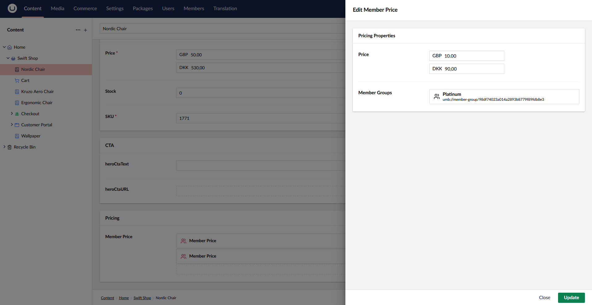
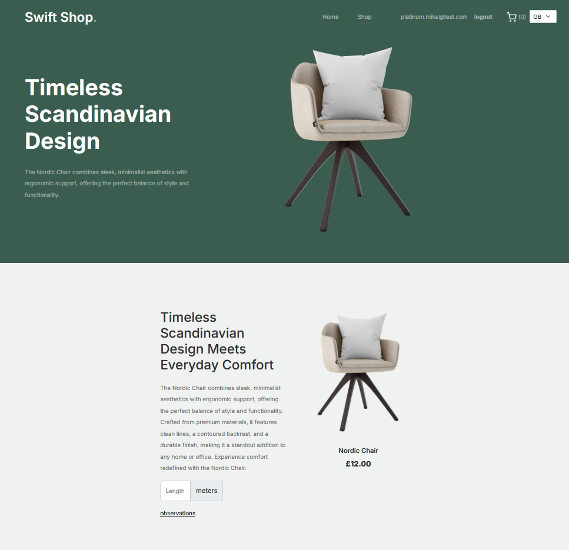
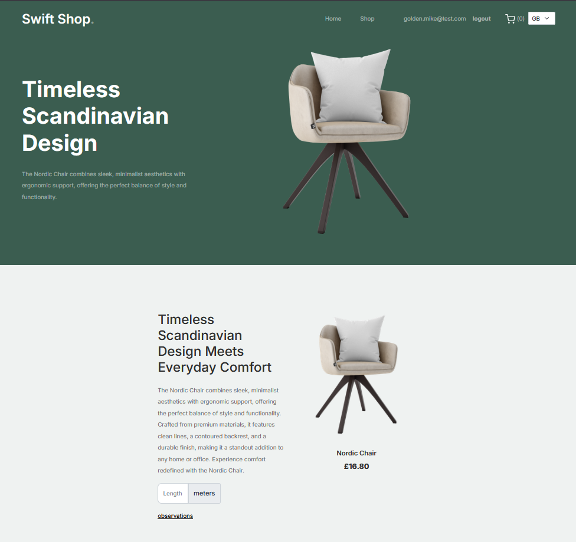

# Member Based Pricing

With Umbraco Commerce you can use a flexible pricing for customers, depending on predefined agreements, and authorization status for the user.

Usually you would capture the product price using the default price property editor. To support this we would need to implement new property editors and return the new prices by implementing a custom `Product Adapter`.

## Backoffice Configuration

First we will define our member group based price property editor.


We are using [`Umbraco.Community.Contentment`](https://www.nuget.org/packages/Umbraco.Community.Contentment/6.0.0-alpha004) package for selecting the member groups.

We will be using two member groups:
* Platinum
* Gold

And one member each:


Our product page will include this property editor with a `Block List` property editor.


Then we will set prices for specific member groups.



## Product Adapter

To enable the system to read the price using the newly created property editor, we will need to implement a product adapter.

This will identity the logged in user, and lookup in the current content node if there is a new price definition based on member group.

In our custom adapter we will be working with the snapshot of the product, keep all properties untouched except the `_prices`, which will be evaluated based on our requirements.

````csharp
public class MemberProductAdapter : UmbracoProductAdapter
{
    private readonly IHttpContextAccessor _httpContextAccessor;
    private readonly IMemberService _memberService;
    private readonly IMemberGroupService _memberGroupService;
    private readonly UmbracoCommerceContext _umbracoCommerce;

    public MemberProductAdapter(
        IUmbracoContextFactory umbracoContextFactory,
        IContentService contentService,
        PublishedContentWrapperFactory publishedContentWrapperFactory,
        IExamineManager examineManager,
        PublishedContentHelper publishedContentHelper,
        IUmbracoProductNameExtractor umbracoProductNameExtractor,
        UmbracoCommerceServiceContext services,
        IHttpContextAccessor httpContextAccessor,
        IMemberService memberService,
        IMemberGroupService memberGroupService,
        UmbracoCommerceContext umbracoCommerce)
        : base(umbracoContextFactory, contentService, publishedContentWrapperFactory, examineManager, publishedContentHelper, umbracoProductNameExtractor, services)
    {
        _httpContextAccessor = httpContextAccessor;
        _memberService = memberService;
        _memberGroupService = memberGroupService;
        _umbracoCommerce = umbracoCommerce;
    }

    public override async Task<IProductSnapshot> GetProductSnapshotAsync(Guid storeId, string productReference, string productVariantReference, string languageIsoCode, CancellationToken cancellationToken = default)
    {
        var baseSnapshot = await base.GetProductSnapshotAsync(storeId, productReference, productVariantReference, languageIsoCode) as UmbracoProductSnapshot;

        return baseSnapshot == null
            ? null
            : new MemberProductSnapshotDecorator(baseSnapshot, _httpContextAccessor, _memberService, _memberGroupService, _umbracoCommerce);
    }
}

public class MemberProductSnapshotDecorator : ProductSnapshotBase
{
    private readonly UmbracoProductSnapshot _baseSnapshot;

    public MemberProductSnapshotDecorator(
        UmbracoProductSnapshot baseSnapshot,
        IHttpContextAccessor httpContextAccessor,
        IMemberService memberService,
        IMemberGroupService memberGroupService,
        UmbracoCommerceContext umbracoCommerce)
    {
        _baseSnapshot = baseSnapshot;

        _prices = new Lazy<IEnumerable<ProductPrice>>(delegate
        {
            List<ProductPrice> prices = new List<ProductPrice>();

            // Check if authenticated and if member prices are defined
            if (httpContextAccessor.HttpContext != null
                && httpContextAccessor.HttpContext.User.Identity.IsAuthenticated
                && baseSnapshot.Content is Product productPage
                && productPage.MemberPrice.Any())
            {
                var memberId = httpContextAccessor.HttpContext.User.Claims.FirstOrDefault(x => x.Type == ClaimTypes.NameIdentifier)?.Value;

                var memberGroupName = memberService.GetAllRoles(int.Parse(memberId)).First();
                var memberGroupKey = memberGroupService.GetByName(memberGroupName).Key;

                var memberPrice = productPage.MemberPrice
                    .Select(x => x.Content as MemberPrice)
                    .FirstOrDefault(x => x.MemberGroups.InvariantEquals(memberGroupKey.ToString()));
                if (memberPrice != null)
                {
                    List<ProductPrice> list2 = new List<ProductPrice>();

                    var currencies = umbracoCommerce.Services.CurrencyService.GetCurrenciesAsync(_baseSnapshot.StoreId).ConfigureAwait(false).GetAwaiter().GetResult();
                    foreach (CurrencyReadOnly currency in currencies)
                    {
                        var productPrice = memberPrice.Price.TryGetPriceFor(currency.Id);
                        if (memberPrice.Price != null && productPrice.Success)
                        {
                            list2.Add(new ProductPrice(productPrice.Result.Value, productPrice.Result.CurrencyId));
                        }
                    }

                    return list2;
                }
            }

            return _baseSnapshot.Prices;
        });
    }

    public override Guid StoreId => _baseSnapshot.StoreId;

    public override string ProductReference => _baseSnapshot.ProductReference;

    public override string ProductVariantReference => _baseSnapshot.ProductVariantReference;

    public override string Sku => _baseSnapshot.Sku;

    public override string Name => _baseSnapshot.Name;

    public override Guid? TaxClassId => _baseSnapshot.TaxClassId;

    private readonly Lazy<IEnumerable<ProductPrice>> _prices;
    public override IEnumerable<ProductPrice> Prices => _prices.Value;

    public override IDictionary<string, string> Properties => _baseSnapshot.Properties;

    public override bool IsGiftCard => _baseSnapshot.IsGiftCard;
}
````

## Results

The expected result for this standard product page


For a `Platinum` member



And for a `Gold` member




