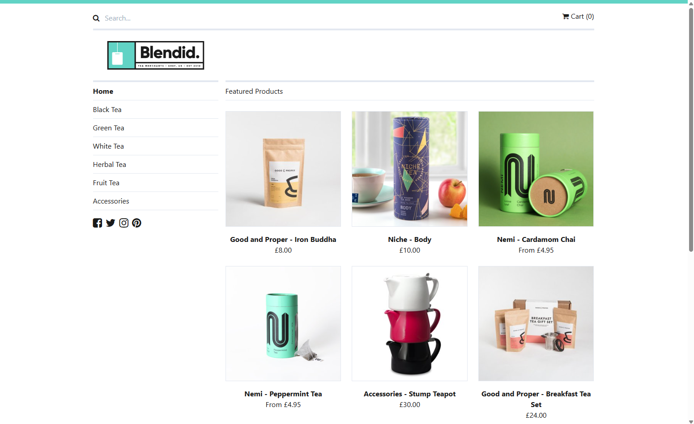

# Overview

In this tutorial we will guide you through the process of setting up an Umbraco Commerce store in Umbraco from begging to end. We'll set up a store, create our products, and configuring a complete customer checkout flow.

This tutorial will be based around the official **Blendid Demo Store** solution, a fictional tea supplier web store. The source code for which can be found on [GitHub](https://github.com/umbraco/Umbraco.Commerce.DemoStore).


This tutorial assumes that you already have the relevant site structure and content views in place for your store. We will just focus on adding the commerce functionality to your existing site.


## Next steps

 Installation   
 Creating a Store   
 Creating your first Product   
 Implementing a Shopping Cart   
 Implementing a Checkout Flow   
 Configuring Store Permissions   
