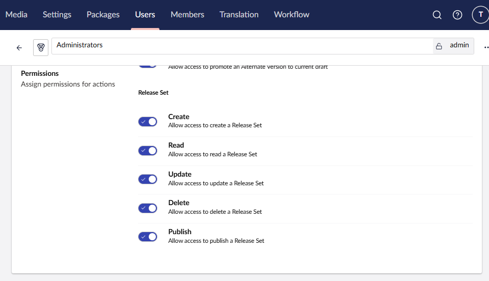
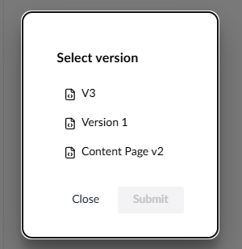
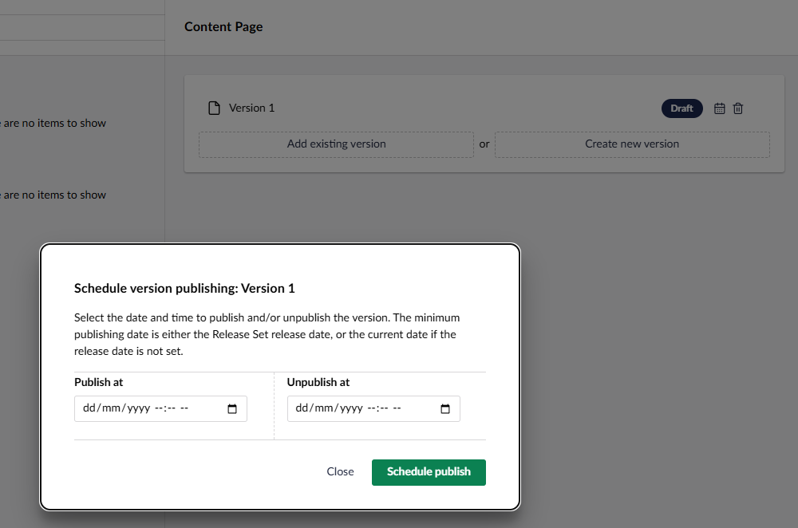
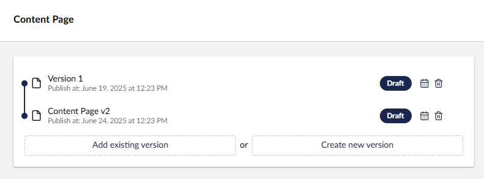
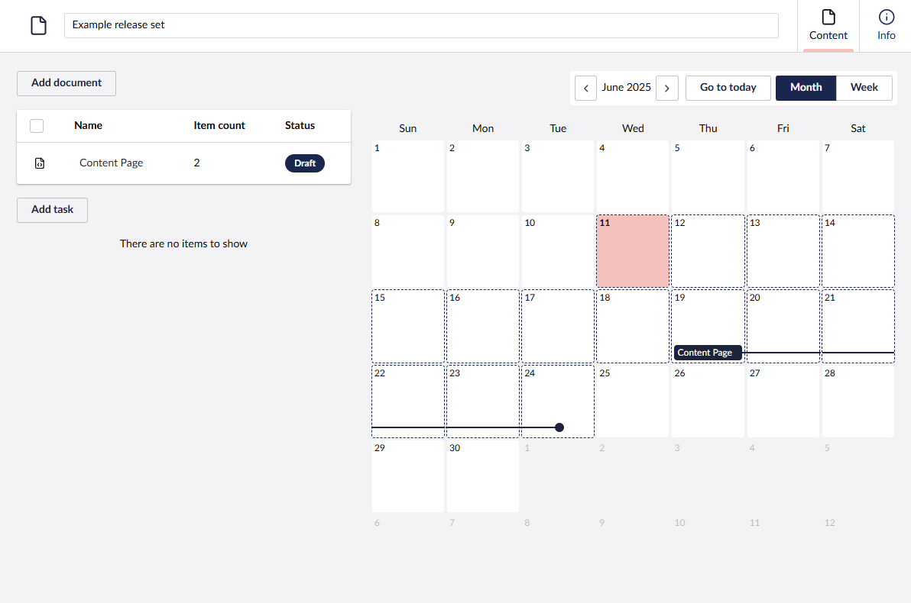
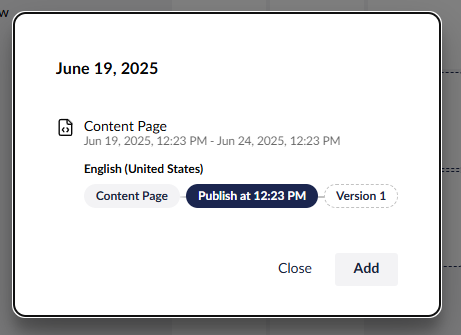

# Release Sets


This feature requires a license. Learn more about [Workflow's licensing model](https://umbraco.com/products/umbraco-workflow).


Release Sets are collections of [Alternate Versions](../alternate-versions/alternate-versions.md), where each version can be scheduled independently. Release Sets provides a holistic overview of scheduled content and enables building and managing content schedules to drive digital campaigns.

Release Sets is currently (v16.0.0) available behind a feature flag. To enable the feature, add the following to the `appsettings.json` file:

```json
"Umbraco": {
    "Workflow": {
        ... // other settings
        "FeatureFlags": ["ReleaseSets"]
    }
}
```

## Working with Release Sets

-   Ensure the User Group permissions are set to allow appropriate access.
    
-   Navigate to the **Release Sets** dashboard in the **Content** section.
    
-   Click the `Create` button to open a workspace modal to create a new set.
    

A Release Set is comprised of document versions and (optionally) tasks. Tasks are like to-dos that should be tracked alongside the Release Set, but are not necessarily CMS activities.

For example, a task might be to finalize digital advertising. It is not a CMS activity, but it is a requirement that must be met before publishing the Release Set.

### Adding documents

-   Click the **Add document** button.
-   Select the document node from the picker.
-   Add or create a new version of the selected document in the versions editor.

-   Adding an existing version opens the version picker. Creating a new version opens the [Alternate Version](../alternate-versions/alternate-versions.md) workspace editor.

- After selecting or creating a version, it is displayed in the version editor.

- The selected version can then be scheduled.

- Multiple versions of the same document can be added and scheduled in sequence.

- After submitting the modal, the updated versions are displayed in the overlay. The documents list shows the selected documents, while the calendar shows the Release Set and its components.

- Selecting a day in the calendar displays the content changes scheduled for that date.

- The `Add` button in the calendar day dialog allows adding items to the Release Set, similar to the `Add document` button in the main overview.

### Publishing a Release Set

A Release Set can be published immediately or scheduled for future publication. To publish a Set, all assigned versions and tasks must be either `Ready to publish` (versions) or `Complete` (tasks). If all components in the Set are in the required status, it can be published by a user with the appropriate permission.

Publishing content within the Release Set is managed by a recurring hosted service, similar to scheduled content publishing.

As publishing progresses, each document version is promoted to be the current backoffice draft, and then published as normal. A version of the original backoffice draft is preserved as an Alternate Version and can be republished or edited in the future.

When a Release Set has no further changes to publish, the status is updated to `Complete`. The Set can then be deleted, or updated and republished. Content published within the Set is preserved and can be further edited or included in a new Release Set.